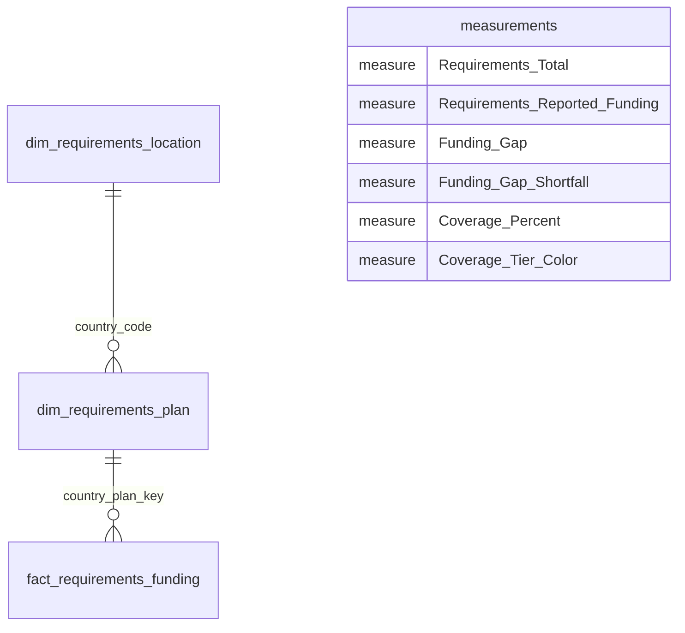

# Humanitarian Giving Observatory

- **Author:** [Valentin Te](https://www.linkedin.com/in/valentinte)
- **Project:** Power BI analysis and a GitHub Pages case study
- **Live case study:** [View the Humanitarian Giving Observatory](https://valentinte93.github.io/humanitarian-giving-observatory/)
- **Repository:** [valentinTe93/humanitarian-giving-observatory](https://github.com/valentinTe93/humanitarian-giving-observatory)

## Project overview

The **Humanitarian Giving Observatory** examines how reported humanitarian funding compares with recorded funding requirements in the UN Office for the Coordination of Humanitarian Affairs (OCHA) Financial Tracking Service (FTS) data.

> **Governing question:** How well does reported funding cover global humanitarian funding requirements?

This is a descriptive analysis of reported financial records. It is **not** a measure of humanitarian need, severity, people affected, suffering, funding impact, or donor intent. A recorded funding gap should not be interpreted as a measure of unmet human need.

The project has two complementary outputs: a Power BI dashboard for interactive exploration and a static case-study page that presents the aligned-period findings and their caveats.

## Dashboard preview


## Repository contents

```text
.
├── .gitignore
├── Humanitarian_giving_observatory.pbix  # Power BI report and data model
├── README.md                             # Project overview and repository guide
├── Report.md                             # Analytical report source
├── Report.pdf                            # Formatted analytical report
├── natural_earth_countries.geojson.gz    # Root-level copy of the boundary file
├── data/
│   ├── country_codes_iso3.csv             # Country and geographic lookup
│   ├── fts_requirements_funding_global.csv # OCHA FTS requirements/funding extract
│   └── natural_earth_countries.geojson.gz # Boundary geometry used by figure script
├── docs/
│   ├── .nojekyll                          # Keeps Pages output as static files
│   ├── CONSULTING_REPORT.pdf              # Pages-served copy of Report.pdf
│   ├── Process_documentation.pdf          # Preparation, model, measures, and limits
│   ├── assets/                            # Built site CSS/JS and page image copies
│   ├── dashboard.gif                      # Power BI dashboard preview
│   ├── figures/                            # Report figures and model diagram
│   └── index.html                         # GitHub Pages entry point
└── scripts/
    └── build_report_figures.py            # Regenerates report figures from source data
```

The root-level `natural_earth_countries.geojson.gz` is a duplicate of `data/natural_earth_countries.geojson.gz`; the figure-generation script uses the copy under `data/`.

`docs/figures/` holds the stable report figures, while `docs/assets/` contains the bundled copies and compiled CSS/JavaScript used by the live page. The repeated chart/map images are intentional: **keep `docs/assets/`** when maintaining the published site.

## Case-study report and website

- Read the report online: [`Report.md`](Report.md).
- Download the formatted report: [`Report.pdf`](Report.pdf).
- See the preparation and model documentation: [`docs/Process_documentation.pdf`](docs/Process_documentation.pdf).
- Visit the [live case-study page](https://valentinte93.github.io/humanitarian-giving-observatory/).

GitHub Pages serves the compiled static page from `docs/index.html` and its supporting files in `docs/assets/`. The page also uses `docs/CONSULTING_REPORT.pdf`, a copy of the root `Report.pdf`, so visitors can open the report from the site. The repository currently contains the published build output; it does not contain the editable React/Vite site source.

## Data and analytical scope

The Power BI model uses two analytical inputs and a separate map-boundary file:

| Repository file | Role |
| --- | --- |
| [`data/fts_requirements_funding_global.csv`](data/fts_requirements_funding_global.csv) | OCHA FTS global requirements-and-funding extract. The checked-in snapshot has 3,848 rows and reporting years from 1999 to 2031. |
| [`data/country_codes_iso3.csv`](data/country_codes_iso3.csv) | Lookup for location codes, country names, ISO Alpha-3 codes, regions, and sub-regions. |
| [`data/natural_earth_countries.geojson.gz`](data/natural_earth_countries.geojson.gz) | Country boundary geometry for the report map; it is not funding or needs evidence. |

The analysis focuses on recorded requirements and reported funding against those requirements. Funding-only records outside the requirements period are retained for dashboard validation, but excluded from the like-for-like case-study comparisons.

### Headline results

| Measure | Comparable window: 2000–2026 | Power BI all-record validation context |
| --- | ---: | ---: |
| Recorded requirements | USD 531.38bn | USD 531.38bn |
| Reported funding | USD 428.92bn | USD 430.83bn |
| Requirements less reported funding | USD 102.47bn | USD 100.55bn |
| Reported funding ÷ requirements | 80.72% | 81.08% |

The two columns use different record scopes and should not be presented as the same-period result. The all-record dashboard context includes funding-only records outside 2000–2026; the report uses the comparable-period column for annual, geographic, and shortfall analyses.

The ratio also has a denominator-completeness caveat: within 2000–2026, **USD 140.37bn** of reported funding appears on rows with a blank requirement field. Under the documented measure logic, that funding remains in the numerator while blank requirements do not contribute to the denominator. Therefore, 80.72% is an extract-level ratio, not a row-matched rate against fully observed requirements.

Annual aggregate coverage ranges from **52.4% in 2025** to **204.5% in 2005**. The 2026 value is provisional in the checked-in snapshot: requirements are populated on only **45 of 164 records** for that year. Values above 100% are retained; they mean reported funding exceeds recorded requirements in the selected context, not that a humanitarian outcome has been achieved.

## Power BI model

The documented final model is a requirements-focused snowflake schema. Its fact-table grain is **one country–plan–reporting-year record**:



| Model table (inside the PBIX) | Purpose |
| --- | --- |
| `dim_requirements_location` | One row per cleaned location code, enriched with country name, ISO Alpha-3 code, region, and sub-region. |
| `dim_requirements_plan` | Country-plan attributes and the `country_plan_key` used to connect plans to the fact table. |
| `fact_requirements_funding` | Annual requirements and reported funding at country–plan–reporting-year grain. |
| `measurements` | Dedicated home for the six DAX measures used by report cards and visuals. |

The active relationships are one-to-many and single-direction: location filters plans through country code, and plans filter the fact through `country_plan_key`. The source coverage field is retained for reference; headline coverage is recalculated from requirements and reported funding so that it responds coherently to report filters.

The detailed preparation steps, field names, relationship logic, DAX definitions, and validation notes are documented in [`docs/Process_documentation.pdf`](docs/Process_documentation.pdf).

## Measures and interpretation

The six measures documented for the report are:

- **`Requirements_Total`** — sum of recorded requirements in the current filter context.
- **`Requirements_Reported_Funding`** — sum of reported funding in the current filter context, including funding on rows with blank requirements.
- **`Funding_Gap`** — requirements minus reported funding; it can be negative when funding exceeds requirements.
- **`Funding_Gap_Shortfall`** — positive part of the funding gap; zero when funding meets or exceeds requirements.
- **`Coverage_Percent`** — reported funding divided by requirements; not capped at 100%.
- **`Coverage_Tier_Color`** — map color by coverage band, with a distinct color for blank/no-data values.

Coverage bands are below 50%, 50% to below 80%, 80% to below 100%, and 100% or above. Values over 100% mean reported funding exceeds the recorded requirement in the selected context; they are not an outcome measure.

## Executive Overview

The documented Executive Overview page contains:

1. Four KPI cards for total requirements, reported funding, funding gap, and coverage.
2. An annual combo chart with requirements and reported funding as columns and coverage as a line.
3. A geographic Shape Map colored by coverage band.
4. A Top 10 ranking of the largest positive funding-gap shortfalls.
5. A reporting-year slicer for context-sensitive analysis.

The map communicates geographic variation in **reported financial coverage**; it does not rank need. The shortfall ranking identifies locations where recorded requirements exceed reported funding; it is not a ranking of humanitarian suffering.

## Limitations

- FTS data describe reported financial information, not the full universe of humanitarian financing, need, or outcomes.
- Recent, future, blank, or partial records require caution. Low apparent coverage may reflect incomplete reporting as well as a financial gap.
- The analysis does not establish why a requirement is underfunded, whether funding arrived on time, whether reported amounts were fully disbursed, or what outcomes followed.
- The analysis is annual. Monthly, quarterly, fiscal-year, year-to-date, or rolling-period analysis would require an explicit date dimension.
- Geographic enrichment improves readability and mapping but does not create funding evidence. Unmatched or non-standard location codes should remain visible for data-quality review rather than being assigned an invented country identity.

## Reproducing the project

Open `Humanitarian_giving_observatory.pbix` in Microsoft Power BI Desktop. The source extract, country lookup, and map-boundary data are included under `data/`. To regenerate the report figures, run the following from the repository root in an environment with Python and Matplotlib installed:

```bash
python3 scripts/build_report_figures.py
```

Refresh the Power BI file after changing a query or relationship. Review [`docs/Process_documentation.pdf`](docs/Process_documentation.pdf) for the model and measure definitions and [`Report.md`](Report.md) for the analytical narrative and references.
