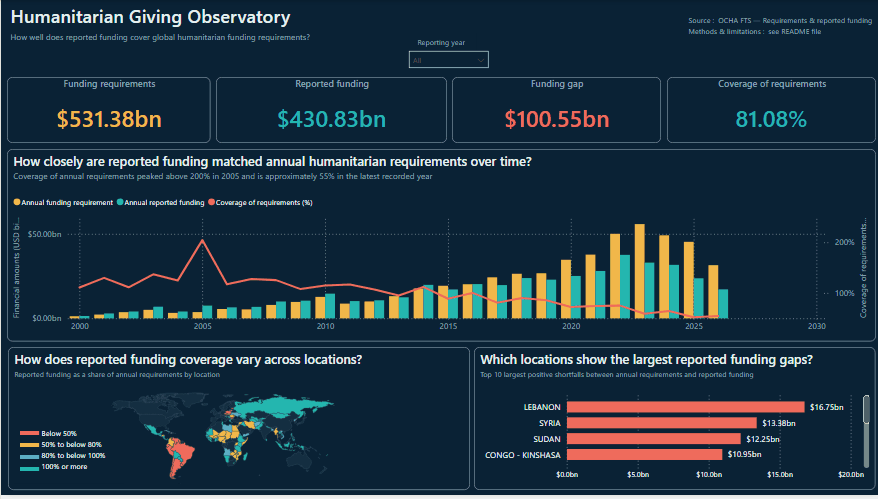

# Humanitarian Giving Observatory

**Author:** Valentin Te     
**Tooling:** Microsoft Power BI | Power Query | DAX | Data Modeling  
**Data Source:** [UN OCHA Financial Tracking Service (FTS)](https://fts.unocha.org/)

---

## Executive Summary

The **Humanitarian Giving Observatory** is a financial analysis portfolio dashboard examining how reported funding compares with recorded humanitarian funding requirements across reporting years and geographic locations.

The primary governing analytical question is:
> **How well does reported funding cover global humanitarian funding requirements?**

> [!WARNING]
> **Analytical Scope Disclaimer:** This dashboard describes recorded financial requirements and reported funding coverage. It is a financial observatory and **must not** be interpreted as a direct measure of humanitarian need, severity, affected populations, or human suffering.

---

---

## Dashboard Preview



---

## Data Sources & Provenance

The project uses public humanitarian financing data managed by **UN OCHA Financial Tracking Service (FTS)** alongside standard country classification references:

| File / Query Name | Role in Project | Source / Provenance | Coverage / Details |
| :--- | :--- | :--- | :--- |
| **`fts_requirements_funding_global.csv`** | Core Fact Source | [UN OCHA FTS](https://fts.unocha.org/) / [HDX Data Platform](https://data.humdata.org/) | Annual global requirement and reported funding extracts (Reporting Years 1999–2031). |
| **`stg_requirements_funding`** | Staging Layer | Power Query transformation step | Source preservation layer retaining raw schema before downstream modeling. |
| **`lookup_country_codes_iso3.csv`** | Geographic Reference | [DataHub Country Codes](https://datahub.io/) | ISO Alpha-3, country names, regions, and sub-regions used to enrich location data. |
| **`dim_requirements_location`** | Location Dimension | Derived from staging query | Deduplicated, uppercase-cleaned location codes mapped to country attributes. |
| **`dim_requirements_plan`** | Plan Dimension | Derived from staging query | Attributes for humanitarian response plans joined via `country_plan_key`. |

> [!NOTE]
> **Reporting Period Note:** While the raw extract contains records through 2031, the core dashboard analysis focuses on the active reporting period (2000–2026). Recent or future years may show partial coverage due to reporting lag in OCHA FTS updates.


## Data Model & Architecture

The analytical engine relies on a **Requirements-focused Snowflake Schema** engineered via Power Query and DAX:

```text
+---------------------------+       +-----------------------+       +---------------------------+
| dim_requirements_location |  (1)  | dim_requirements_plan |  (1)  | fact_requirements_funding |
|---------------------------|-------|-----------------------|-------|---------------------------|
| location_code             |<---(N)| country_code          |<---(N)| country_plan_key          |
| country_name              |       | country_plan_key      |       | reporting_year            |
| iso_alpha_3               |       | plan_code             |       | requirements_usd          |
| region                    |       | plan_id               |       | reported_funding_usd      |
| sub_region                |       | plan_name             |       | reported_coverage_pct     |
+---------------------------+       +-----------------------+       +---------------------------+
```

### Physical Tables
* **`fact_requirements_funding`**: Financial facts at the `country-plan-reporting-year` grain.
* **`dim_requirements_plan`**: Attributes for humanitarian country plans keyed via `country_plan_key`.
* **`dim_requirements_location`**: Enriched geographic dimension containing ISO Alpha-3 codes, country names, regions, and sub-regions.
* **`measurements`**: Dedicated DAX calculation layer for measures and visual formatting rules.

---

## Key Measures (DAX)

### 1. Total Requirements
```dax
Requirements_Total = 
SUM (
    fact_requirements_funding[requirements_usd]
)
```

### 2. Reported Funding
```dax
Requirements_Reported_Funding = 
SUM (
    fact_requirements_funding[reported_funding_usd]
)
```

### 3. Funding Gap
```dax
Funding_Gap = 
[Requirements_Total] - [Requirements_Reported_Funding]
```

### 4. Funding Gap Shortfall (Positive Gap Only)
```dax
Funding_Gap_Shortfall = 
MAX (
    0,
    [Funding_Gap]
)
```

### 5. Coverage Percentage
```dax
Coverage_Percent = 
DIVIDE (
    [Requirements_Reported_Funding],
    [Requirements_Total]
)
```

### 6. Dynamic Coverage Color Tier (Map Visuals)
```dax
Coverage_Tier_Color = 
VAR CoverageValue = [Coverage_Percent]
RETURN
    SWITCH (
        TRUE (),
        ISBLANK ( CoverageValue ), "#142E40", -- Blank / No Data
        CoverageValue < 0.50,      "#F06B5B", -- <50% Coverage (Low)
        CoverageValue < 0.80,      "#F2B84B", -- 50-79% Coverage (Partial)
        CoverageValue < 1.00,      "#5FC8C3", -- 80-99% Coverage (Near-full)
        "#25B7B0"                             -- >=100% Coverage (Full)
    )
```

---

## Key Dashboard Visualizations

1. **Executive KPI Cards:** Global summary displaying Total Requirements, Reported Funding, Funding Gap, and Coverage %.
2. **Annual Requirements vs. Coverage (Combo Chart):** Clustered columns showing financial values over time alongside a coverage percentage line.
3. **Geographic Coverage (Shape Map):** Dynamic choropleth map categorized by the 4 coverage bands using `Coverage_Tier_Color`.
4. **Top 10 Funding Gap Shortfalls (Bar Chart):** Ranks the top 10 locations with the largest positive financial shortfalls.

---

## Data Limitations & Considerations

> [!NOTE]
> **Data Quality & Interpretation Notes:**
> * **Reporting Lag:** Incomplete or recent reporting years may show artificially low coverage due to data submission delays rather than actual financial shortfalls.
> * **Analytical Scope:** The model focuses strictly on requirements and reported funding; incoming/outgoing funding flows are excluded from this analytical scope.
> * **Non-Causality:** The observatory tracks financial records descriptive of OCHA FTS uploads and does not explain *why* funding gaps exist or measure on-the-ground operational impact.

```
