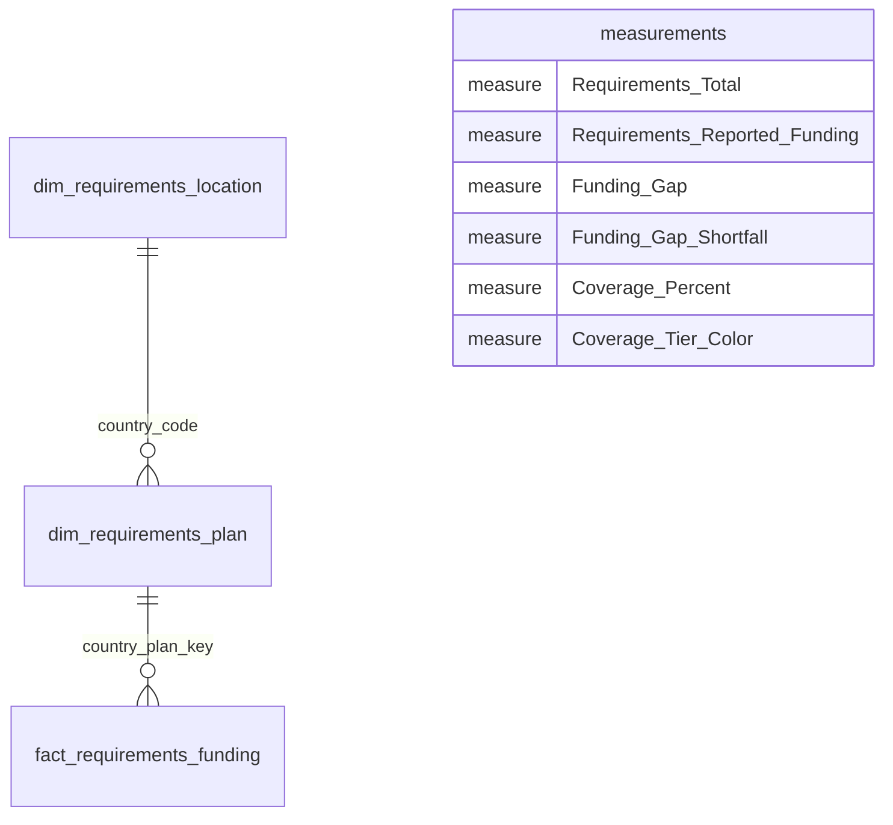

# Humanitarian Giving Observatory

- **Author:** Valentin Te    
- **Format:** Microsoft Power BI portfolio dashboard
- **Data:** Public humanitarian requirements and reported-funding records from the UN Office for the Coordination of Humanitarian Affairs (OCHA) Financial Tracking Service (FTS)

## Project overview

The **Humanitarian Giving Observatory** is a financial observatory built in Power BI. It examines how reported funding compares with recorded humanitarian funding requirements across reporting years and locations.

> **Governing question:** How well does reported funding cover global humanitarian funding requirements?

This is a descriptive analysis of recorded financial requirements and reported funding. It is **not** a direct measure of humanitarian need, severity, affected people, human suffering, funding impact, or donor intent. A recorded shortfall should not be interpreted as a measure of unmet human need.

## Dashboard preview


## Repository contents

```text
.
├── CONSULTING_REPORT.md                     # Analytical report source
├── CONSULTING_REPORT.pdf                    # Formatted report
├── Humanitarian_giving_observatory.pbix  # Power BI report and data model
├── README.md                             # Project overview and repository guide
├── data/
│   ├── country_codes_iso3.csv               # Country and geographic lookup
│   ├── fts_requirements_funding_global.csv  # OCHA FTS requirements/funding extract
│   └── natural_earth_countries.geojson.gz   # Boundary geometry used for report map
├── docs/
│   ├── Process_documentation.pdf            # Scope, model, measures, visuals, and limitations
│   ├── dashboard.gif                        # Dashboard preview shown above
│   └── figures/                             # Rebuilt report visuals
│       ├── annual_coverage.png
│       ├── coverage_map_2000_2026.png
│       ├── model_relationships.png
│       └── top10_shortfall_2000_2026.png
└── scripts/
    └── build_report_figures.py              # Regenerates the data-driven report figures
```

The Power Query staging and lookup queries, final model tables, relationships, DAX measures, and report visuals are contained in the `.pbix` file; they are **not** separate files in the repository.

The analytical report is available as [`Report.md`](Report.md) and [`Report.pdf`](Report.pdf). It separates the Power BI all-record validation context from the comparable 2000–2026 analysis and documents the denominator-completeness caveat. Report figures are stored in `docs/figures/` and can be regenerated from the checked-in CSVs and boundary file with `python3 scripts/build_report_figures.py`.

## Data and scope

The Power BI model uses two checked-in analytical data files; the report map also uses the Natural Earth-derived boundary file listed below.

| Repository file | Role |
| --- | --- |
| [`data/fts_requirements_funding_global.csv`](data/fts_requirements_funding_global.csv) | OCHA FTS global requirements-and-funding extract. The checked-in extract contains annual records with `countryCode`, plan attributes, `year`, `requirements`, `funding`, and `percentFunded` fields; its year values range from 1999 to 2031. |
| [`data/country_codes_iso3.csv`](data/country_codes_iso3.csv) | Geographic lookup with `location_code`, `country_name`, `iso_alpha_3`, `region`, and `sub_region`. |
| [`data/natural_earth_countries.geojson.gz`](data/natural_earth_countries.geojson.gz) | Compressed Natural Earth-derived country polygons used only as map geometry; see the report references for provenance. |

The active analytical scope is deliberately limited to **recorded requirements** and **reported funding against those requirements**. Incoming- and outgoing-funding tables are not part of the final model. The annual source data can include incomplete or future reporting years; low coverage in such periods may reflect reporting lag or incomplete records.

Sources and background:

- [OCHA Financial Tracking Service](https://fts.unocha.org/)
- [Humanitarian Data Exchange (HDX)](https://data.humdata.org/)
- [DataHub country-code reference](https://datahub.io/)

## Power BI model

The documented final model is a requirements-focused snowflake schema. Its fact-table grain is **one country–plan–reporting-year record**:



| Model table (inside the PBIX) | Purpose |
| --- | --- |
| `dim_requirements_location` | One row per cleaned location code, enriched with country name, ISO Alpha-3 code, region, and sub-region. |
| `dim_requirements_plan` | Country-plan attributes and the `country_plan_key` used to connect plans to the fact. |
| `fact_requirements_funding` | Annual requirements and reported funding at country–plan–reporting-year grain. |
| `measurements` | Dedicated home for the six DAX measures used by report cards and visuals. |

The active relationships are one-to-many and single-direction: location filters plans through country code, and plans filter the fact through `country_plan_key`. The source coverage field is retained for reference; headline coverage is recalculated from requirements and reported funding so that it responds coherently to report filters.

The detailed preparation steps, field names, relationship logic, DAX definitions, and validation notes are documented in [`docs/Process_documentation.pdf`](docs/Process_documentation.pdf).

## Measures and interpretation

The six measures documented for the report are:

- **`Requirements_Total`** — sum of recorded requirements in the current filter context.
- **`Requirements_Reported_Funding`** — sum of reported funding recorded against requirements.
- **`Funding_Gap`** — requirements minus reported funding. It can be negative when reported funding exceeds requirements.
- **`Funding_Gap_Shortfall`** — the positive part of the funding gap; zero when reported funding meets or exceeds requirements.
- **`Coverage_Percent`** — reported funding divided by requirements. Coverage is not capped at 100%.
- **`Coverage_Tier_Color`** — map color by coverage band, with a distinct color for blank/no-data values.

Coverage bands are below 50%, 50% to below 80%, 80% to below 100%, and 100% or above. Values over 100% mean reported funding exceeds the recorded requirement in the selected context; they are not an outcome measure.

## Executive Overview

The documented Executive Overview contains:

1. Four KPI cards for total requirements, reported funding, funding gap, and coverage.
2. An annual combo chart with requirements and reported funding as columns and coverage as a line.
3. A geographic Shape Map colored by coverage band.
4. A Top 10 ranking of the largest positive funding-gap shortfalls.
5. A reporting-year slicer for context-sensitive analysis.

The map communicates geographic variation in **reported financial coverage**; it does not rank need. The shortfall ranking identifies locations where recorded requirements exceed reported funding; it is not a ranking of humanitarian suffering.

## Limitations

- FTS records describe reported financial information, not the full universe of humanitarian financing or the needs and outcomes of affected people.
- Recent, future, blank, or partial records require caution; apparent low coverage may reflect incomplete reporting as well as a financial gap.
- The analysis is descriptive and does not establish why a requirement is underfunded, whether funding arrived on time, whether reported amounts were fully disbursed, or what outcomes followed.
- Time analysis is annual. Daily, monthly, quarterly, fiscal-year, year-to-date, or rolling-period analysis would require an explicit date dimension.
- Geographic enrichment improves readability and mapping but does not create funding evidence. Unmatched or non-standard location codes should remain visible for data-quality review rather than being assigned an invented country identity.

## Reproducing the project

Open `Humanitarian_giving_observatory.pbix` in Microsoft Power BI Desktop. The source extract, country lookup, and map boundary data are included under `data/`. To regenerate the report charts, install Matplotlib if needed and run `python3 scripts/build_report_figures.py` from the repository root. Refresh the Power BI file after changing a query or relationship, and review [`docs/Process_documentation.pdf`](docs/Process_documentation.pdf) for the model and measure definitions.
